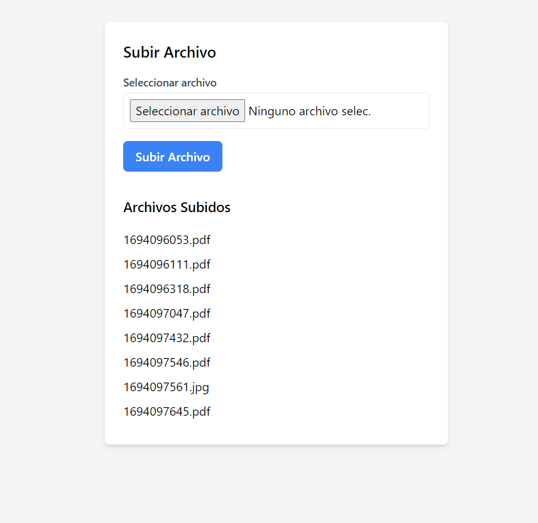

# Proyecto de Subida y Visualización de Archivos
Este proyecto es una aplicación web simple que permite a los usuarios cargar archivos y ver los archivos cargados previamente. La aplicación está desarrollada utilizando el framework Laravel y se centra en la gestión de archivos.

## Funcionalidades Principales

1. **Subir Archivos:** Los usuarios pueden cargar archivos en la aplicación. La aplicación admite archivos de imagen (jpg, png) y archivos PDF con un tamaño máximo de 2MB. Se valida que los archivos sean válidos antes de la carga.

2. **Visualizar Archivos Cargados:** Los usuarios pueden ver la lista de archivos que han sido cargados previamente. Los nombres de los archivos se muestran en una lista en la interfaz de usuario.

## Requisitos de Configuración

- Se debe configurar el sistema de archivos en Laravel para que utilice un disco personalizado llamado "uploads". Los archivos se almacenan en la carpeta `storage/app/uploads`.

## Uso de la Aplicación

1. Abre la aplicación en tu navegador.

2. En la página principal, verás un formulario que te permite seleccionar y cargar archivos. Se proporcionan mensajes de error si se intenta cargar un archivo que no cumple con los requisitos.

3. Después de cargar un archivo exitosamente, verás un mensaje de éxito y el archivo se agregará a la lista de "Archivos Subidos" en la parte inferior de la página.

4. Si no se han subido archivos previamente, se mostrará el mensaje "No se han subido archivos".

## Autores

- **Benjamin Tavarez**: [Enlace al perfil de GitHub](https://github.com/SirBeho)
